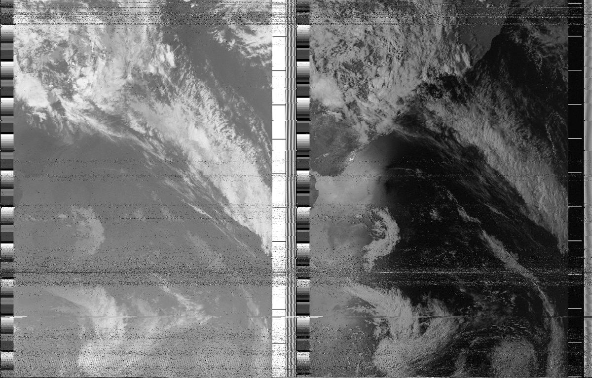
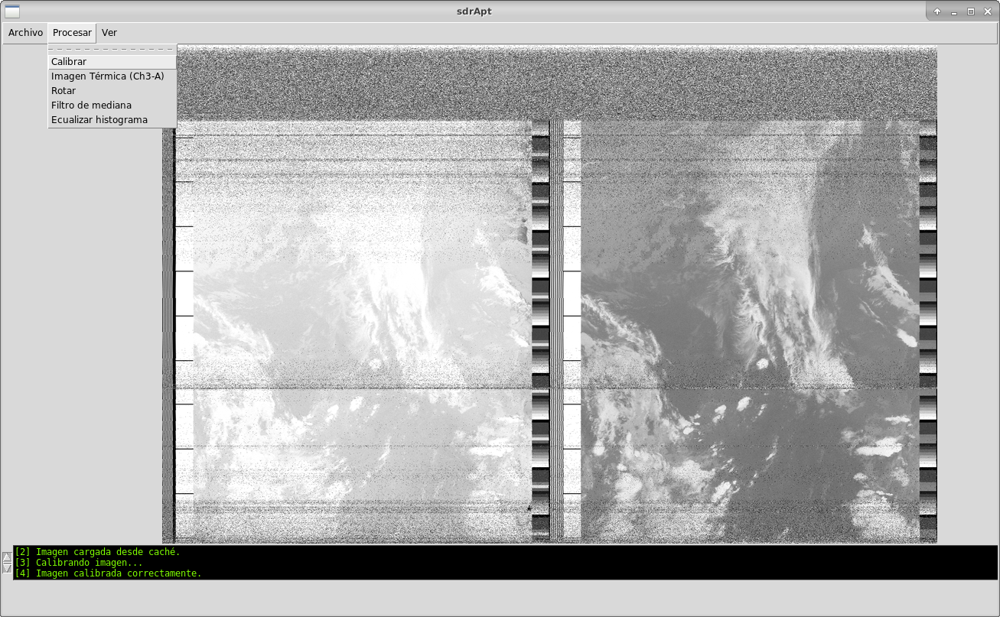

# Imágenes satelitales NOAA APT con SDR  :satellite:

Framework para la demodulación, decodificación y procesamiento de imágenes de satélites meteorológicos NOAA. 

Basado parcialmente en [apt-decoder](https://github.com/zacstewart/apt-decoder).

## Instalación

### Dependencias necesarias de Python

- Numpy
- Scipy
- PIL
- Matplotlib

Pueden instalarse via pip mediante el comando:

``sudo pip install numpy scipy matplotlib Pillow``

Descargar sdr-apt, puede hacerlo desde terminal con el siguiente comando:

``git clone https://gitlab.fing.edu.uy/tallerine-inalambrico/sdr-apt.git``

## Demodulación

La demodulación se realiza en GnuRadio mediante el flowgraph **AptRx.grc**, disponible en la carpeta gnuradio. La primera vez que se ejecute debe modificarse el campo "value" del bloque "Prefix" para incluir la ruta correcta.

El flowgraph **AptRx-data.grc** tiene como entrada una grabación de satélite registrada mediante un sdr, el archivo .dat se puede decargar [desde aquí](https://iie.fing.edu.uy/investigacion/grupos/artes-old/noaa/2019.01.05.16.36.27.dat).

## Decodificación

La función decode de apt se encarga de decodificar la señal demodulada AM generada en GNU Radio:

``matrix = apt.decode('wav/am_demod/2019.03.04.19.30.49.wav')``

## Interfaz gráfica
Se puede correr en terminal con ``python apt-gui.py``

